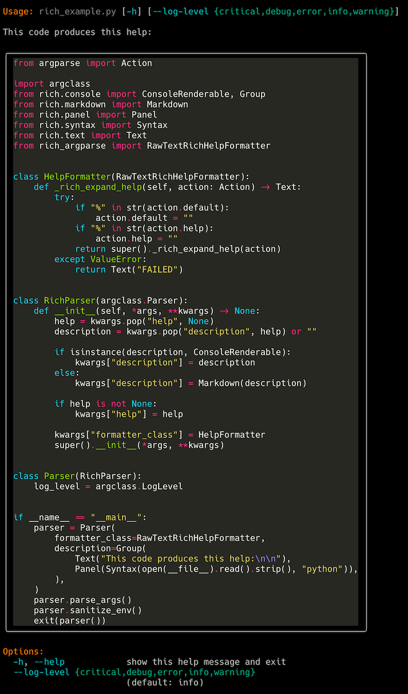

# Third-Party Integrations

**argclass** builds on the standard library's `argparse`, so many argparse
extensions work with argclass.

---

## Rich Help Output

Use `rich_argparse` for beautiful help formatting:

```python
import argclass

class Parser(argclass.Parser):
    verbose: bool = False
    output: str = "result.txt"

# Requires: pip install rich-argparse
# from rich_argparse import RawTextRichHelpFormatter
# parser = Parser(formatter_class=RawTextRichHelpFormatter)
# parser.print_help()
```



---

## Logging Configuration

Integrate with Python's logging module:

```python
import argclass
import logging

class Parser(argclass.Parser):
    log_level: str = argclass.Argument(
        "-l", "--log-level",
        default="INFO",
        choices=["DEBUG", "INFO", "WARNING", "ERROR", "CRITICAL"],
        help="Set logging level"
    )
    log_file: str | None = argclass.Argument(
        "--log-file",
        default=None,
        help="Log to file instead of stderr"
    )

    def configure_logging(self) -> None:
        handlers = []
        if self.log_file:
            handlers.append(logging.FileHandler(self.log_file))
        else:
            handlers.append(logging.StreamHandler())

        logging.basicConfig(
            level=getattr(logging, self.log_level),
            format="%(asctime)s - %(name)s - %(levelname)s - %(message)s",
            handlers=handlers,
            force=True,
        )

parser = Parser()
parser.parse_args([])
parser.configure_logging()
```

---

## pytest Integration

Test your CLI with pytest:

<!--- name: test_integrations_pytest --->
```python
import pytest
import argclass

class Parser(argclass.Parser):
    name: str
    count: int = 1

@pytest.fixture()
def parser():
    parser = Parser()
    parser.parse_args(["--name", "test"])
    return parser

def test_parser_defaults(parser):
    assert parser.name == "test"
    assert parser.count == 1
```

---

## Accessing the Underlying ArgumentParser

Use `create_parser()` to get the underlying `argparse.ArgumentParser` instance
for integrations that need direct access to the parser structure:

<!--- name: test_integrations_create_parser --->
```python
import argclass

class Parser(argclass.Parser):
    """My application."""
    name: str = argclass.Argument(help="User name")
    verbose: bool = False

parser = Parser()
argparse_parser = parser.create_parser()

# Inspect parser structure
assert len(argparse_parser._actions) > 0

# Access help text
help_text = argparse_parser.format_help()
assert "User name" in help_text
```

This is useful for tools that inspect argument structure, generate documentation,
or need argparse compatibility.

:::{warning}
`create_parser()` does **not** back populates parser attributes.
Always use `parse_args()` to actually parse command-line arguments.
:::
