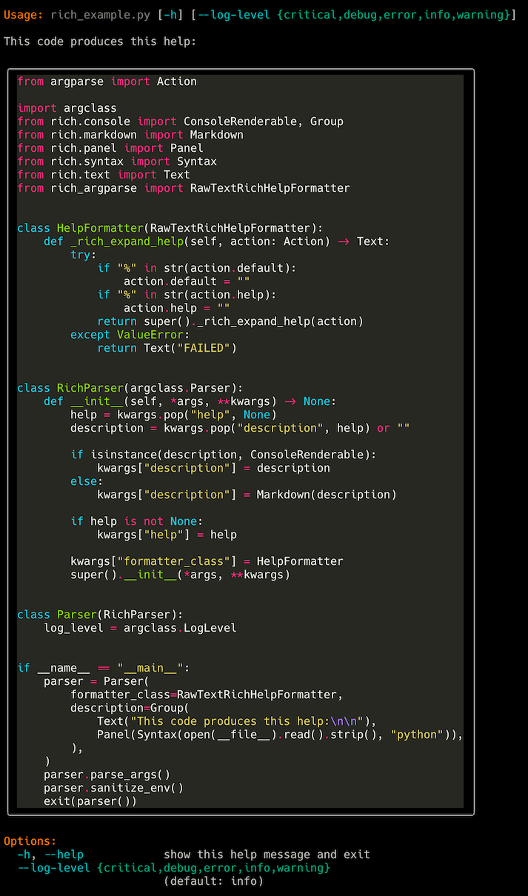

# Third-Party Integrations

**argclass** builds on the standard library's `argparse`, so many argparse
extensions work with argclass.

:::{note}
**Why do argparse extensions work with argclass?**

argclass passes all `**kwargs` through to argparse:
- `Parser(**kwargs)` forwards to `argparse.ArgumentParser(**kwargs)`
- `Argument(**kwargs)` forwards to `parser.add_argument(**kwargs)`

This means any library that works with argparse works with argclass.
:::

## Rich Help Output

Use `rich_argparse` for beautiful help formatting:

```python
import argclass

class Parser(argclass.Parser):
    verbose: bool = False
    output: str = "result.txt"

# Requires: pip install rich-argparse
# from rich_argparse import RawTextRichHelpFormatter
# parser = Parser(formatter_class=RawTextRichHelpFormatter)
# parser.print_help()
```



---

## Shell Completions

Use `argcomplete` to add tab completion for bash, zsh, fish, and other shells.
Since argclass builds on argparse, argcomplete works via `create_parser()`.

### Installation

```bash
pip install argcomplete
```

### Basic Usage

Pass the underlying argparse parser to `argcomplete.autocomplete()`:

<!--- name: test_integrations_argcomplete --->
```python
import argclass

class Parser(argclass.Parser):
    """My CLI application."""
    name: str = argclass.Argument(help="User name")
    output: str = argclass.Argument(
        "-o", "--output",
        default="result.txt",
        help="Output file"
    )
    format: str = argclass.Argument(
        choices=["json", "yaml", "csv"],
        default="json",
        help="Output format"
    )

def main():
    parser = Parser()

    # Enable shell completion (requires: pip install argcomplete)
    try:
        import argcomplete
        # Pass the underlying argparse parser
        argcomplete.autocomplete(parser.create_parser())
    except ImportError:
        pass  # argcomplete not installed

    parser.parse_args([])
    # ... rest of application

# For testing
parser = Parser()
parser.parse_args(["--name", "test", "--format", "yaml"])
assert parser.name == "test"
assert parser.format == "yaml"
```

### Activating Completions

After installing argcomplete, activate completion for your script:

```bash
# For bash (add to ~/.bashrc)
eval "$(register-python-argcomplete my-cli-tool)"

# Or activate for all argcomplete-enabled scripts
activate-global-python-argcomplete
```

For zsh, add to `~/.zshrc`:

```bash
autoload -U bashcompinit
bashcompinit
eval "$(register-python-argcomplete my-cli-tool)"
```

### Complete Application Example

Here's a complete CLI script with shell completion support:

```python
#!/usr/bin/env python3
# PYTHON_ARGCOMPLETE_OK
"""Example CLI with shell completion."""

import argclass

class CLI(argclass.Parser):
    """File processor with shell completion."""

    input_file: str = argclass.Argument("input_file", help="Input file to process")
    output: str = argclass.Argument("-o", "--output", default="out.txt")
    format: str = argclass.Argument(
        "-f", "--format",
        choices=["json", "yaml", "xml"],
        default="json"
    )
    verbose: bool = False

def main():
    cli = CLI()

    # Shell completion support
    try:
        import argcomplete
        argcomplete.autocomplete(cli.create_parser())
    except ImportError:
        pass

    cli.parse_args()
    print(f"Processing {cli.input_file} -> {cli.output} ({cli.format})")

if __name__ == "__main__":
    main()
```

The `# PYTHON_ARGCOMPLETE_OK` comment enables global completion discovery.

:::{tip}
See the [argcomplete documentation](https://github.com/kislyuk/argcomplete)
for advanced features like custom completers and file completion.
:::

---

## Logging Configuration

argclass provides a pre-built `LogLevel` argument for easy logging integration.
It accepts level names (`debug`, `info`, `warning`, `error`, `critical`)
case-insensitively and returns the corresponding `logging` module constant.

### Using the Built-in LogLevel

<!--- name: test_integrations_loglevel --->
```python
import argclass
import logging

class Parser(argclass.Parser):
    log_level: int = argclass.LogLevel

parser = Parser()
parser.parse_args(["--log-level", "debug"])

assert parser.log_level == logging.DEBUG
logging.basicConfig(level=parser.log_level)
```

### Custom Logging Setup

For more control, combine `LogLevel` with additional options:

```python
import argclass
import logging

class Parser(argclass.Parser):
    log_level: int = argclass.LogLevel
    log_file: str | None = argclass.Argument(
        "--log-file",
        default=None,
        help="Log to file instead of stderr"
    )

    def configure_logging(self) -> None:
        handlers = []
        if self.log_file:
            handlers.append(logging.FileHandler(self.log_file))
        else:
            handlers.append(logging.StreamHandler())

        logging.basicConfig(
            level=self.log_level,
            format="%(asctime)s - %(name)s - %(levelname)s - %(message)s",
            handlers=handlers,
            force=True,
        )

parser = Parser()
parser.parse_args([])
parser.configure_logging()
```

## pytest Integration

Test your CLI with pytest:

<!--- name: test_integrations_pytest --->
```python
import pytest
import argclass

class Parser(argclass.Parser):
    name: str
    count: int = 1

@pytest.fixture()
def parser():
    parser = Parser()
    parser.parse_args(["--name", "test"])
    return parser

def test_parser_defaults(parser):
    assert parser.name == "test"
    assert parser.count == 1
```

---

## Accessing the Underlying ArgumentParser

Use `create_parser()` to get the underlying `argparse.ArgumentParser` instance
for integrations that need direct access to the parser structure:

<!--- name: test_integrations_create_parser --->
```python
import argclass

class Parser(argclass.Parser):
    """My application."""
    name: str = argclass.Argument(help="User name")
    verbose: bool = False

parser = Parser()
argparse_parser = parser.create_parser()

# Inspect parser structure
assert len(argparse_parser._actions) > 0

# Access help text
help_text = argparse_parser.format_help()
assert "User name" in help_text
```

This is useful for tools that inspect argument structure, generate documentation,
or need argparse compatibility.

:::{warning}
`create_parser()` does **not** back populate parser attributes.
Always use `parse_args()` to actually parse command-line arguments.
:::
